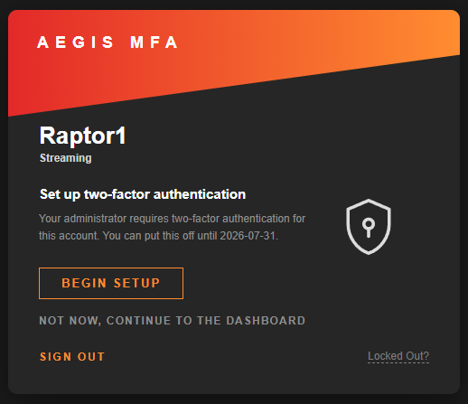
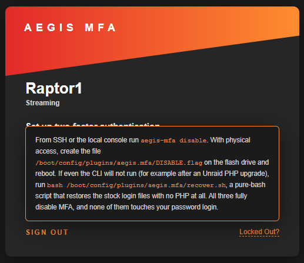
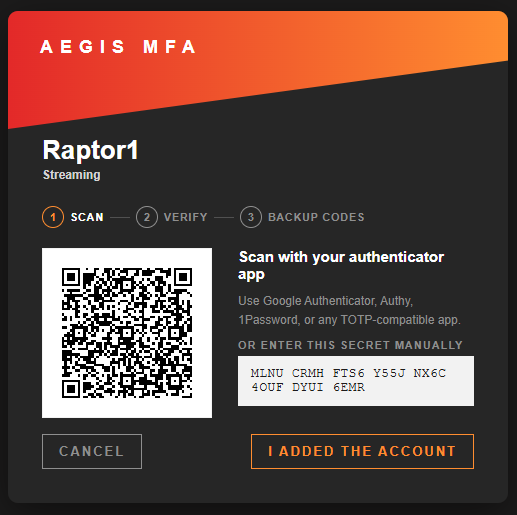
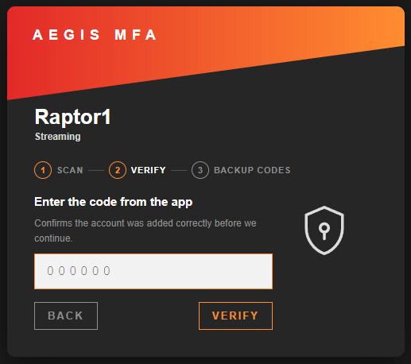
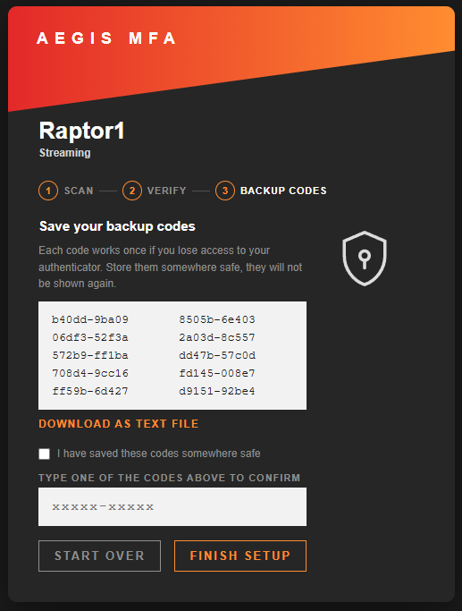
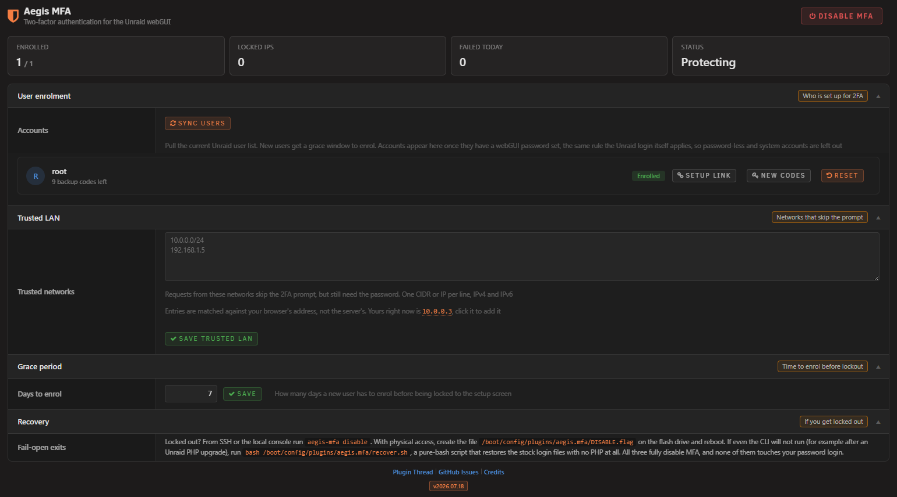

# Aegis MFA for Unraid

Two-factor authentication for the Unraid webGUI. After your password, enter a 6-digit code from any authenticator app. Per user, with backup codes, a trusted LAN bypass, and lockout protection.

<p align="center">
  &nbsp;
  &nbsp;
  &nbsp;
  
</p>

## What it does

Unraid protects the webGUI with a password and nothing else. The usual answer is to put Authelia behind a reverse proxy, which means a container, a subdomain, a certificate, and a configuration file for every service. Aegis MFA is the small answer: install the plugin, scan a QR code, done.

It hooks into the authentication Unraid already has. Every request already passes through an internal gate, and the plugin adds one question to it: this session has the password, has it also passed 2FA? If not, the login page asks for a code instead of sending you to the dashboard. Nothing else about the login changes.

The whole design is built around one rule: a fault must never lock you out. Every failure path in the plugin ends with MFA turning itself off, not with a closed door. There are four independent ways back in even when it is working correctly and you have lost your phone.

## Features

- TOTP codes: Works with Google Authenticator, Authy, 1Password, Bitwarden, or any RFC 6238 app. No cloud, no push, no account
- Per user: Every Unraid user enrols separately, with their own secret and their own backup codes
- Setup wizard: Scan a QR, confirm a code, save your backup codes. The QR is generated on the server, so the secret never leaves the machine
- Backup codes: Ten single-use codes, shown once. Enrolment does not finish until you type one back, which proves you actually saved them
- Trusted LAN: Skip the code prompt from networks you trust (IPv4 and IPv6 CIDR). The password is still required, and your browser's address is shown ready to add with one click
- Lockout protection: Too many wrong codes locks the IP out for a while. Counters live in RAM, so a brute-force attempt never wears out your flash drive
- Replay protection: A code that has already been used is refused even inside its own 30-second window
- Dry-run: The first 24 hours after you enable it, the login shows the prompt with a skip link and a failed code is logged but not blocked. Confirm it works before it can ever stop you
- Grace period: A newly created Unraid user is nudged at login, with a skip, for a configurable window before the setup screen becomes mandatory
- Clock-skew help: A failed code shows the server's own time, which is the usual reason TOTP suddenly stops matching
- Audit trail: Every success and every failure goes to the syslog with the user and the source IP
- Fail-open by design: Corrupt config, a missing file, an Unraid update, an uninstall gone wrong. Every one of them ends with MFA off and password-only login, never with a locked door
- Self-healing: A boot hook and a ten-minute cron re-apply the login patches if an Unraid update removes them
- Watchdog alert: An Unraid notification fires if MFA is on but the login patches are missing, and once more when protection returns
- Untested-release notice: The settings page warns when your Unraid release has not been tested with the plugin yet
- Four ways back in: Backup codes, `aegis-mfa disable` over SSH, a `DISABLE.flag` file on the flash drive, or the pure-bash `recover.sh` next to it

**GUI Widget Screenshot**












## How you get back in

This is the part that matters, so it comes before everything else.

**You still have a backup code.** Enter it on the code prompt instead of the 6-digit code. Each one works once.

**You have SSH or the local console.** Run `aegis-mfa disable`. MFA turns off, the login patches are removed, and password-only login is back. Nothing else is touched, and your enrolments are still there when you turn it back on.

**You have physical access to the server.** Put the flash drive in any computer and create an empty file at `config/plugins/aegis.mfa/DISABLE.flag`. On the next boot MFA is off. This one needs nothing but your hands.

**Even the CLI will not run.** After an Unraid PHP upgrade, in the rare case a plugin file no longer parses, run `bash /boot/config/plugins/aegis.mfa/recover.sh`. It is pure bash with no PHP dependency: it restores the two Unraid login files to stock (from the backups it keeps, or by stripping its own hook if the backups are gone) and sets the disable flag. Your enrolments are left untouched.

The first three are the everyday paths; the bash script is the floor beneath them, for the one scenario where PHP itself is the thing that broke.

## Scope and limits

Aegis MFA guards the webGUI login and nothing else. SSH, SMB, NFS, and Docker containers are not affected: they never went through the webGUI login in the first place. It is TOTP only, so no push notifications, no SMS, no hardware keys. Secrets and backup codes are stored on the flash drive, so anyone who can take the flash drive out of the server can read them, which is also true of the passwords already stored there. The trusted LAN bypass is exactly what it says: a request from a trusted subnet skips the code, so it is only as safe as the network you name.

## Requirements

- Unraid 7.3.1 or later

The plugin refuses to install below 7.3.1, deliberately. It patches the login path, and the shape of those files on older releases has not been verified. A hard floor is safer than a guess.

## Installation

**Via Community Applications (recommended)**
1. Open Community Applications in Unraid
2. Search for Aegis MFA
3. Click Install

**Manual Installation**
1. Go to Plugins in Unraid
2. Click Install Plugin
3. Paste the following URL and click Install:
   ```
   https://raw.githubusercontent.com/Lazaros-Chalkidis/unraid-aegis-mfa/main/aegis.mfa.plg
   ```

After installing, open Settings > Aegis MFA. MFA is off until you turn it on.

## First run

1. Open Settings > Aegis MFA and click **Enable MFA**. This starts a 24-hour dry-run: codes are checked and failures are logged, but nothing is blocked yet
2. Log out and back in. You will be asked to set up 2FA. Scan the QR with your app, confirm a code, and save your backup codes
3. Confirm a normal login works with a code from your app
4. Back in Settings, click **Enforce now**. From here on a missing or wrong code stops the login

The dry-run exists so that a clock problem, a mistyped secret, or an unexpected setup cannot lock you out before you have seen it work once.

## Settings

**Settings > Aegis MFA**

- Enable / Disable: The master switch. Disabling removes the login patches immediately
- Enforce now: End the 24-hour dry-run early, once you have confirmed it works
- Trusted LAN: Networks that skip the code prompt, one CIDR or IP per line, IPv4 and IPv6. The password is still required
- Grace period: How many days a newly created user has to enrol before the setup screen becomes mandatory
- Per user: New backup codes, reset a user's 2FA, or hand a pending user a one-time setup link
- Sync users: Reconcile the enrolment list against Unraid's own users. Runs on its own at boot and every ten minutes

**Settings Page**



## Command line

The CLI is on the PATH as `aegis-mfa` and works over SSH or the local console:

- `aegis-mfa status` - enabled and enforcing state, patch state, every user's MFA status
- `aegis-mfa enable` / `aegis-mfa disable` - the same switches as the settings page
- `aegis-mfa enforce [now|Nh]` - end the dry-run now, or (re)start one of N hours
- `aegis-mfa preflight` - readiness report before enabling: anchors, lint, a full rehearsal on copies. Live files are never touched
- `aegis-mfa reconcile` - run the boot and cron consistency check right now
- `aegis-mfa users` - every account with the exact rule that lists or skips it, for when someone is missing from Sync users

## How it works

Unraid already puts every webGUI request through an internal authentication gate (`auth_request` in nginx, answered by `auth-request.php`). The plugin adds one condition to the branch that already decides "this session is logged in": has it also passed 2FA? If not, the gate returns the same 401 Unraid already uses, and nginx sends the browser to the login page, which shows the code prompt instead of the dashboard redirect.

That means two Unraid files carry a small hook: `auth-request.php` and `webGui/include/.login.php`. Both hooks are a dozen lines, and both are written so that any failure at all falls through to Unraid's normal behaviour. If the plugin's own file is missing, if it throws, if it is half-loaded, the request is allowed exactly as it would have been without the plugin. The hooks are bounded by markers, and every write is atomic: the patched copy is built and validated with `php -l` on the side, then swapped into place in one step. A patch that does not compile never reaches the live file, and a vanilla backup sits next to each patched file.

Before either file is touched, its structure is checked: the insertion point must appear exactly once, the file must carry the signatures we expect, and nothing else may have patched it already. A file that fails any of those is left alone and MFA stays off. This is a structural check, not a checksum, which means a new Unraid point release that touches these files cosmetically still works, while a release that genuinely restructures them is refused instead of guessed at.

The patches are re-applied by two independent mechanisms: an event hook at boot and a cron entry every ten minutes. If an Unraid update replaces the login files, the patch is restored automatically. If it replaces them with something we do not recognise, the surviving patch is removed too, so the login is never left half-wired.

Codes are standard TOTP (RFC 6238, SHA1, 6 digits, 30 seconds) with a one-step window either side, which tolerates about thirty seconds of clock drift. A code is compared in constant time, and the step it matched is recorded, so the same code cannot be used twice. Backup codes are bcrypt-hashed and single-use. Secrets and backup codes live on the flash drive; the lockout counters live in RAM so a brute-force attempt never writes to the flash.

## Development

### Requirements
- Unraid 7.3.1 or later (for testing)
- PHP CLI and Bash (for the build script and the test suite)
- Python 3 with OpenCV, optional, for the QR decode cross-check

### Build
```bash
./build.sh                  # release build
./build.sh "" dev           # dev build
./build.sh "" local         # local build (embeds .txz in .plg)
```

The build runs the test suite first and refuses to package if anything fails. A plugin that sits in the login path does not ship on a red test run.

### Tests
```bash
./tests/run-all.sh
```

546 checks across seven suites, none of which need an Unraid box: TOTP against the RFC 6238 and RFC 4226 vectors, the helpers (including a real two-process `flock` contention test), the gate's decision matrix and every fail-open path, the installer against throwaway copies of the two Unraid files (patch, rollback, atomicity, simulated OS updates), the enrolment state machine, the QR encoder, whose output is decoded back with OpenCV to prove it actually scans, and the pure-bash recovery script against real patched fixtures.

### Project structure

```
unraid-aegis-mfa/
├── source/
│   ├── include/
│   │   ├── AegisMfaTotp.php      TOTP core (RFC 6238)
│   │   ├── AegisMfaHelpers.php   session, JSON+flock, CIDR, users, lockout
│   │   ├── AegisMfaGate.php      aegis_mfa_passed(), the fail-open gate
│   │   ├── AegisMfaInstall.php   the patcher and its safety rails
│   │   ├── AegisMfaEnroll.php    enrolment state machine, CSRF, bypass tokens
│   │   ├── AegisMfaAdmin.php     settings actions and the dashboard summary
│   │   ├── AegisMfaQr.php        QR wrapper
│   │   ├── AegisMfaShell.php     the shared login-card shell for the pre-auth pages
│   │   ├── setup.php             the enrolment wizard (served by nginx)
│   │   └── vendor/qrcode.php     QR encoder (MIT, Kazuhiko Arase)
│   ├── scripts/
│   │   ├── aegis-mfa             the CLI, symlinked to /usr/local/sbin
│   │   ├── aegis-mfa-cron        the ten-minute consistency check
│   │   └── aegis-mfa-recover.sh  pure-bash recovery, copied to the flash on install
│   ├── event/
│   │   └── started               boot hook, re-applies the patches
│   ├── images/                   avatar.png only, the plugin mark is inline SVG
│   ├── AegisMfa.page             Settings > Aegis MFA
│   ├── AegisMfaIcon.page         defines the icon class for the Plugins page
│   ├── challenge.view.php        the code prompt
│   ├── aegis-mfa.css             the settings page stylesheet
│   ├── config.default.json       defaults, copied to the flash on first install
│   ├── README.md                 the short text on the Plugins page
│   └── aegis.mfa.cron
├── tests/
├── screenshots/
├── build.sh
├── CHANGELOG.md
├── compat.json                   tested-release checksums, shipped with the package
├── ca_profile.xml
├── aegis.mfa.xml
├── aegismfaplugin.svg            the CA catalog icon
├── LICENSE
└── README.md
```

## Issues and support

- GitHub Issues: https://github.com/Lazaros-Chalkidis/unraid-aegis-mfa/issues

## Author

**Lazaros Chalkidis** - https://github.com/Lazaros-Chalkidis

## License

Copyright (C) 2026 Aegis MFA Unraid Plugin - Lazaros Chalkidis

Licensed under the GNU General Public License v3.0 or later (GPL-3.0-or-later). See the `LICENSE` file for the full text.

The bundled QR encoder (`source/include/vendor/qrcode.php`) is Copyright (c) 2009 Kazuhiko Arase and is used under the MIT license.
